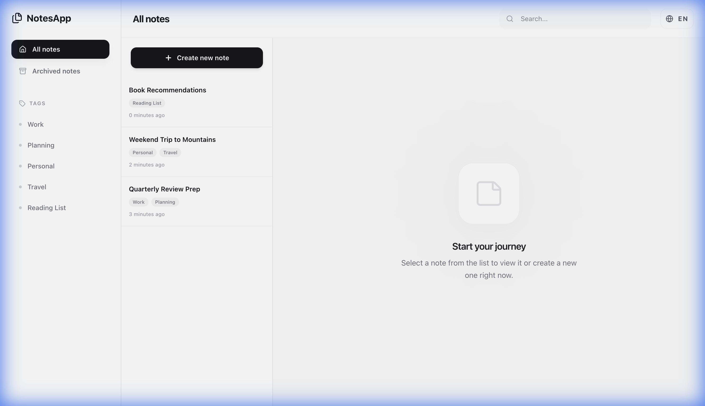
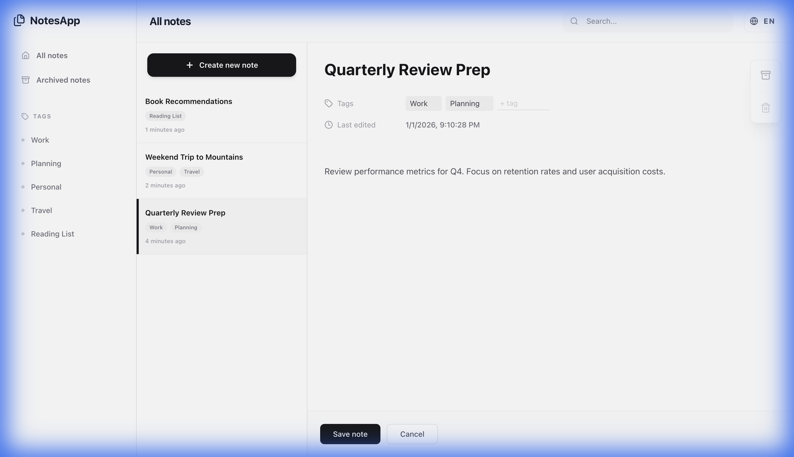
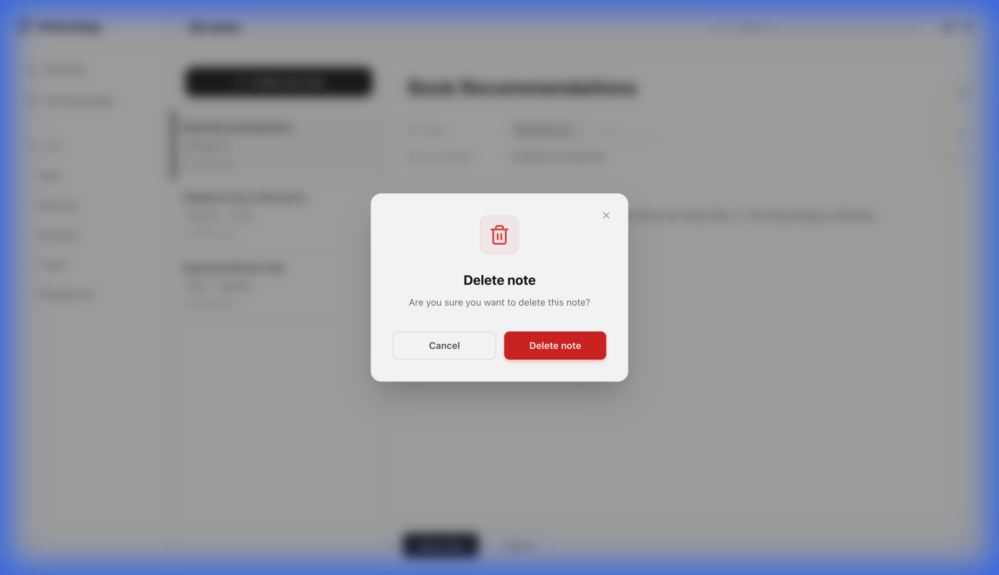
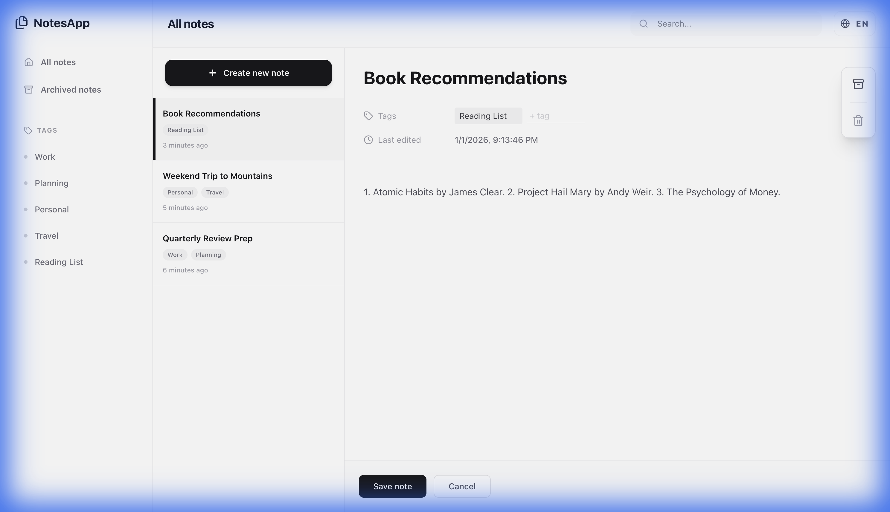
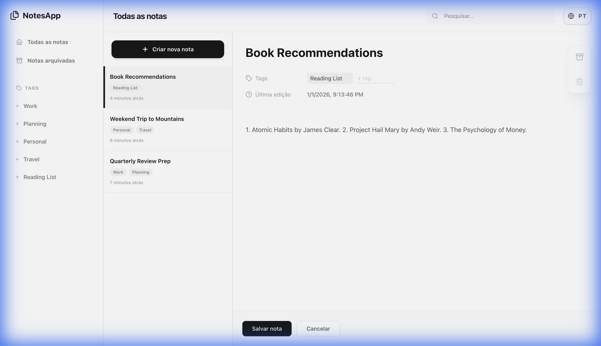

# 📝 NotesApp - Modern Note Management

NotesApp is a sleek, modern, and highly responsive note-taking application built with **React 19**, **Vite**, and **Tailwind CSS 4**. It offers a premium writing experience with real-time tagging, global search, and a seamless internationalization system.

---

## ✨ Visual Showcase



*Organize your life with a professional, distraction-free dashboard.*



*Deep dive into your thoughts with real-time tagging and metadata.*



*Safe data management with intuitive confirmation workflows.*

### 🌍 One-Click Internationalization
NotesApp is built for the global stage. Switch between English and Portuguese instantly with perfect state preservation.




---

## 📽️ Interactive Demos

### 🏷️ Tag Management & Organization
Effortlessly organize your notes. Create, rename, and delete tags in real-time, with instant updates across your entire library.


### 📱 Full Responsiveness
Built for every device. Experience a fluid, adaptive UI that transitions seamlessly between Desktop, Tablet, and Mobile views.


---

## 🚀 Key Functionalities

### 📔 Premium Note Editing
- **Fluid Experience**: A clean, distraction-free environment for your thoughts.
- **Auto-save Logic**: Your changes are persisted instantly, ensuring you never lose a word.
- **Rich Metadata**: Every note tracks its "Last Edited" timestamp with human-readable formatting.
- **Note Archiving**: Keep your workspace tidy by moving notes to the archive and restoring them whenever needed.

### 🏷️ Smart Tagging System
- **Real-time Organization**: Add, edit, and delete tags on the fly.
- **Sidebar Filtering**: Click any tag in the sidebar to instantly filter your notes.
- **Bulk Updates**: Managing a tag affects all associated notes seamlessly.

### 🔍 Global Instant Search
- High-performance search that filters across titles and content.
- Context-aware search: search within the main list, archives, or specific tag views.
- Real-time result counting and visual feedback.

### 🌍 Seamless i18n
- Full support for **English** and **Portuguese**.
- One-click language switching with instant UI updates across the entire app.
- Localized dates, placeholders, and system messages.

### 📱 Responsive & Motion-Rich UI
- **Micro-interactions**: Subtle scale-down effects on buttons and smooth hover transitions.
- **Glassmorphism**: Elegant headers and sidebar backgrounds using Lucide icons.
- **Mobile-First**: Fully responsive layout that adapts gracefully from mobile to ultra-wide screens.

---

## 🛠️ Technical Stack

- **Framework**: [React 19](https://react.dev/)
- **Build Tool**: [Vite](https://vitejs.dev/)
- **Styling**: [Tailwind CSS 4](https://tailwindcss.com/) (using the new JIT engine)
- **Icons**: [Lucide React](https://lucide.dev/)
- **Routing**: React Router 7
- **Validation**: Zod
- **Testing**: Vitest (Unit) & [Cypress](https://www.cypress.io/) (E2E)

---

## 📦 Getting Started

### Prerequisites
- Node.js (v20.19+ or v22.12+)
- Bun or NPM

### Installation

1. Install dependencies:
   ```bash
   npm install
   ```

2. Start the development server:
   ```bash
   npm run dev
   ```

3. Run tests:
   ```bash
   npm run test        # Unit tests
   npm run test:e2e     # E2E tests with Cypress
   ```

---

## 🐳 Docker Support

Deploy the entire app using Docker:

```bash
docker-compose up -d
```

The app will be available at `http://localhost:3000`.

---

## 🧪 Documentation & Quality
This project follows strict software engineering principles:
- **SOLID**: Decoupled services and custom hooks.
- **DRY**: Reusable UI components and design tokens.
- **Stability**: Comprehensive E2E coverage for CRITICAL paths.
